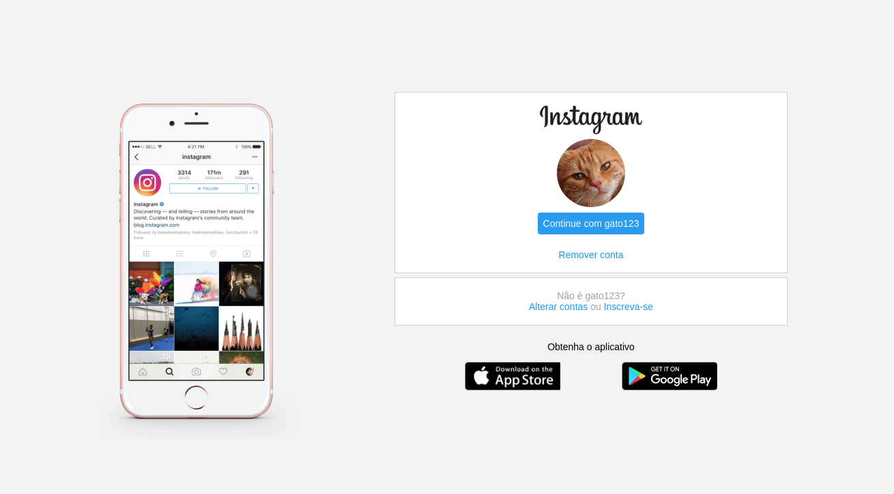

 <h1>PÁGINA INICIAL DO INSTAGRAM</h1>

## __Tecnologias usadas__

* HTML
* CSS

## __Sobre__

Esse é um projeto desenvolvido durante as aulas na [DIO](https://digitalinnovation.one/) (Digital Innovation One), onde foi criada uma réplica da página de login do Instagram.

